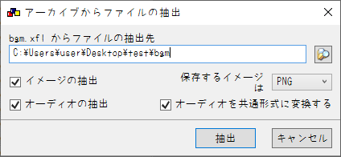

# RSC2ONS_raiL-kagerou
## なにこれ
  2008年にraiL-soft様から発売された、18禁PC向けノベルゲーム'[霞外籠逗留記](https://www.liar.co.jp/raiL/kagerou_top.html)'を<br>
  ONScripter形式へ変換するためのコンバータです<br>

## 再現度
原作との主な違いは以下
 - クリック待ちと改ページ待ちの構文の違いが不明だったので<br>
 強制的に**すべての文章が改ページ待ち**の状態に
 - 上記仕様により画面におけるスペースが余る＆<br>
 低解像度機種での文字潰れを防ぐため文字は原作より大きめ
 - ONScripterの縦書き表示は安定性が低いため<br>
 文字表示は横書き固定、また文字サイズも変更不可
 - 共通ルートの好感度調整が機能していないため、<br>
 個別ルート分岐時の選択肢は何選んでも全開放
 - その他~~いつも通り~~セーブ/ロード画面は超簡略化<br>
 CG/回想モードなどに関しても~~もちろん~~未実装

原作に比べてプレイ感覚が大きく異なりますが、<br>
作品内容そのものの変更は一切ありません<br>
携帯機向けに最適化されていると考えれば悪くない...はず

## 使い方
 1. 適当な作業フォルダを作成
 2. [GARBro](https://drive.google.com/file/d/1gH9nNRxaz8GexN0B1hWyUc3o692bkWXX/view)で以下のxflを(同名のフォルダを作成した上で)作業フォルダへ展開<br>
    - bgm.xfl
    - grpe.xfl
    - grpo.xfl
    - grpo_bu.xfl
    - grps.xfl
    - scr.xfl
    - voice.xfl
    - wav.xfl
  
     設定は以下の通り↓<br>
     
 3. voice内に"1~5.xfl"というファイルがあるので同様に展開<br>
    (展開後、xflは削除してOK)
 4. ゲーム側の"mov"ファルダを作業フォルダへコピー
 5. [gscScriptCompAndDecompiler-cli](https://github.com/PC-CNT/gscScriptCompAndDecompiler-cli/releases/tag/pr12)をDLし作業フォルダへ移動
 6. 展開先のディレクトリで[このコンバータ](https://github.com/Prince-of-sea/RSC2ONS_raiL-kagerou/releases/latest)をDL/起動させ変換<br>
    変換前の時点で以下のような構成になっていればOKです↓<br>
```
C:.
│  default.txt
│  gscScriptCompAndDecompiler.exe
│  RSC2ONS_raiL-kagerou.exe
│  
├─bgm
│      Track01.ogg
│      (～略)
│      Track15.ogg
│      
├─grpe
│      0001.png
│      (～略)
│      9001.png
│      
├─grpo
│      8000.png
│      (～略)
│      9115.png
│      
├─grpo_bu
│      0011.png
│      (～略)
│      7512.png
│      
├─grps
│      cgview.lwg
│      (～略)
│      wait24.lwg
│      
├─mov
│      0002.mpg
│      0003.mpg
│      
├─scr
│      0000.gsc
│      (～略)
│      9999.gsc
│      
├─voice
│  ├─1
│  │      0002.ogg
│  │      (～略)
│  │      9015.ogg
│  │      
│  ├─2
│  │      0002.ogg
│  │      (～略)
│  │      9001.ogg
│  │      
│  ├─3
│  │      0002.ogg
│  │      (～略)
│  │      9002.ogg
│  │      
│  ├─4
│  │      0002.ogg
│  │      (～略)
│  │      9012.ogg
│  │      
│  └─5
│          0002.ogg
│          (～略)
│          9006.ogg
│          
└─wav
        0001.ogg
        (～略)
        0100.ogg
        
```
 7. ウィンドウが消え、0.txtができれば完成<br>
    exe等の不要データを削除し、変換済みファイルと共に利用ハードへ転送

## 注意事項
 - 当然ですが公式ツールではありません
 - __FANZA DL版で動作確認しています__ パッケージ版の動作は未確認
 - 本ツールの使用において生じた問題や不利益などについて、作者は一切の責任を負いません

## その他
本作の変換を追加でサポートする[PSP向け自動変換ツール作ってます](https://github.com/Prince-of-sea/ONScripter_Multi_Converter)<br>
もしPSPで遊ぶ場合はぜひご利用ください(v1.3.0以上推奨)